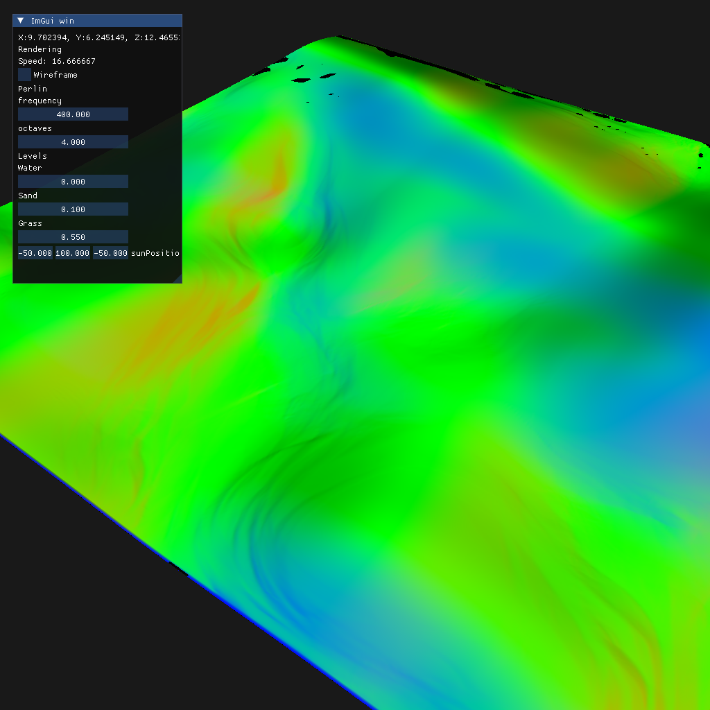
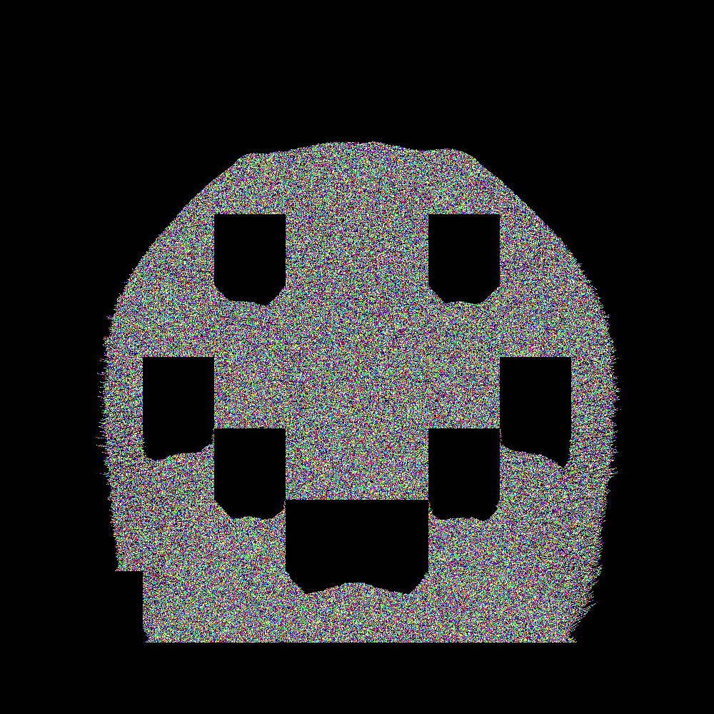
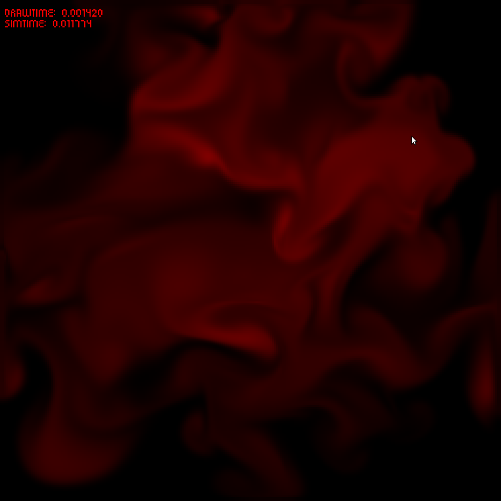
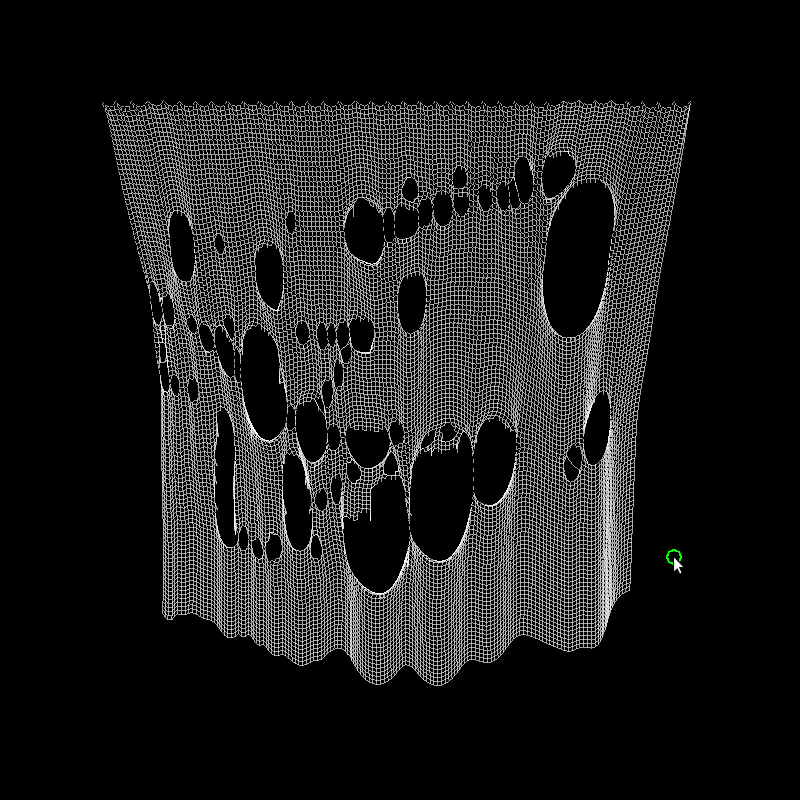
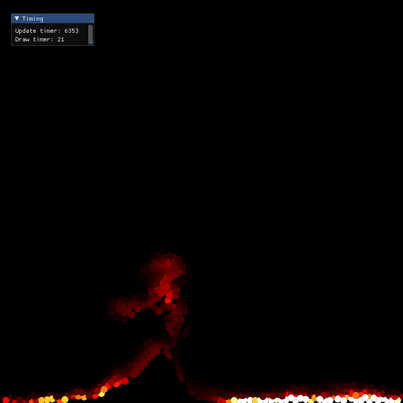
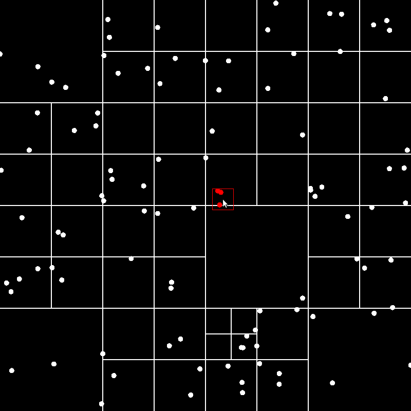

# C++/OpenGL graphics projects

*I always loved computer graphics so from time to time some nice visualization
catches my eye and then the best way how to learn new things is to do it on
your own!*

This is my sandbox folder for different shader/graphic programs which use C++
with OpenGL or SFML.

*** 

#### Building
Building of each project is done using CMAKE. To build a project just navigate
into its directory and run:
```bash
cmake -B build && cd build
make
./<name of the project> # run the compiled program
```
I usually leave projects in runnable state. However, it might happen that there
are some problems and/or compatibility issues and stuff like that (I am going
to try to help resolve your issues if you need help).

## Interesting projects:
### [Terrain with erosion](./terrainOpenGL/)
<p align="center">
  
  
</p>

#
### [Compute Slime](./slime/)
<p align="center">
  
</p>

#
### [RayMarching](./RayMarch/)
<p align="center">
  
</p>

#
### [Compute Falling sand sim test](./falling_sand/)
<p align="center">
  
</p>

#
### [More SFML projects](./SFML/)
<p align="center">
  
  
  
  
</p>

