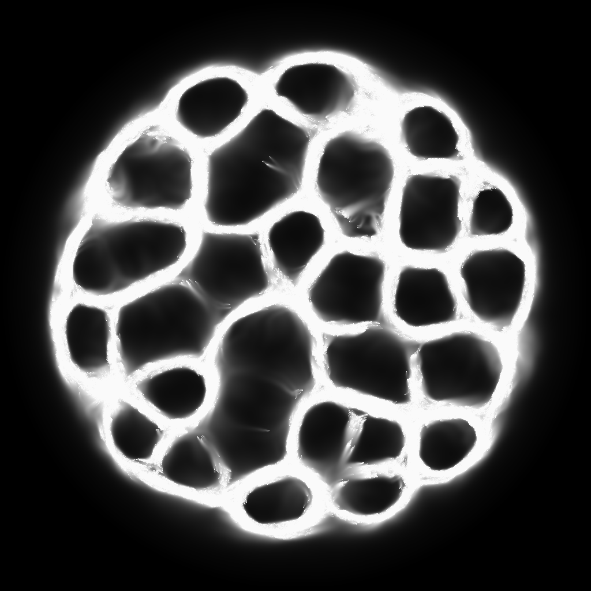

# C++/OpenGL graphics projects

*I always loved computer graphics so from time to time some nice visualization
catches my eye and then the best way how to learn new things is to do it on
your own!*

This is my sandbox folder for different shader/graphic programs which use C++
with OpenGL or SFML.

## Interesting projects:
### [Terrain](./terrainOpenGL/)

  

#
### [Slime](./slime/)

  

#
### [RayMarching](./RayMarch/)

  

#
### [Compute Shader Falling sand sim](./falling_sand/)

  

#
### [More SFML projects](./SFML/)

  
  
  
  

