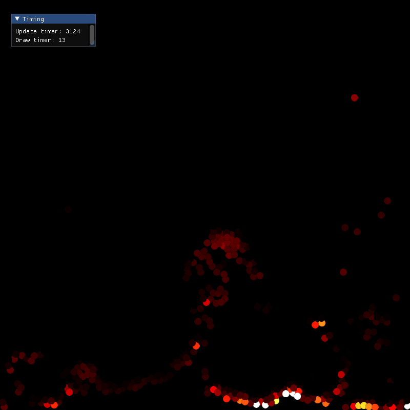

## Collection of different SFML drawing projects

I am using SFML whenever I feel like small primitive shapes are the good way to
go. Not to waste time with "How to color circle in opengl" for example.
You surely cannot do as much in SFML and the speed might not be there, but
that's not what I'm going for in these small projects.

The most interesting ones:

### [Mandatory cloth sim](./Cloth/)

#

### [Particle Fire sim](./Fire/)

#

### [Fluid sim](./DummyFluid/)

#

### [QuadTree visualization](./QuadTree/)

#
