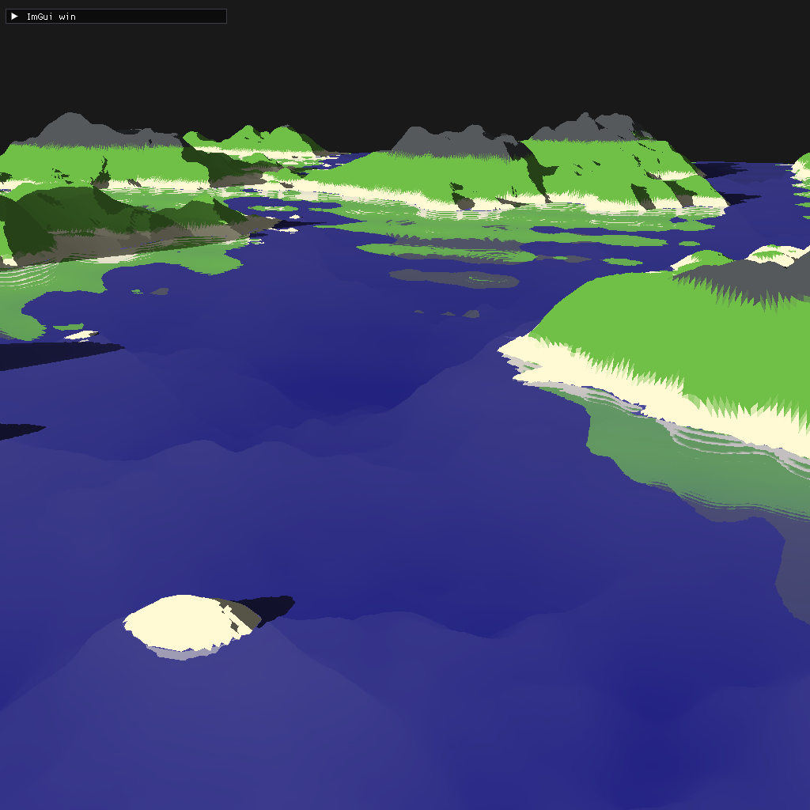
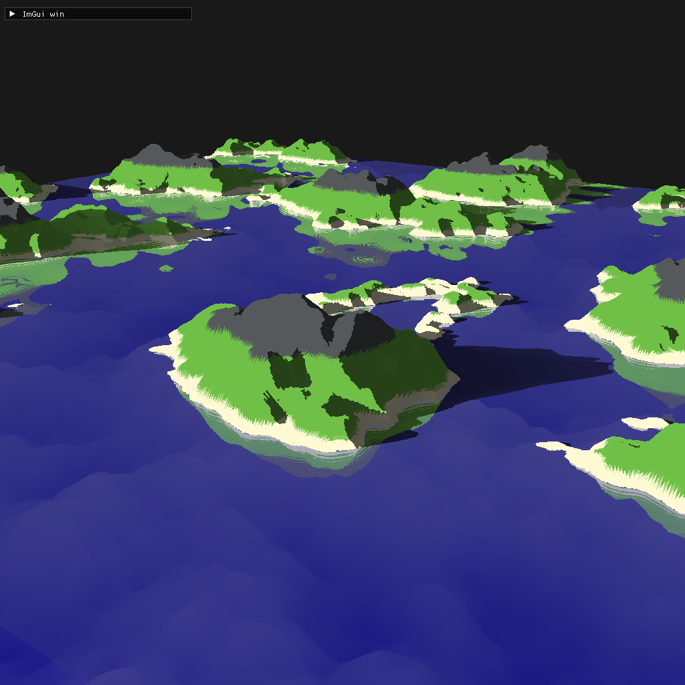
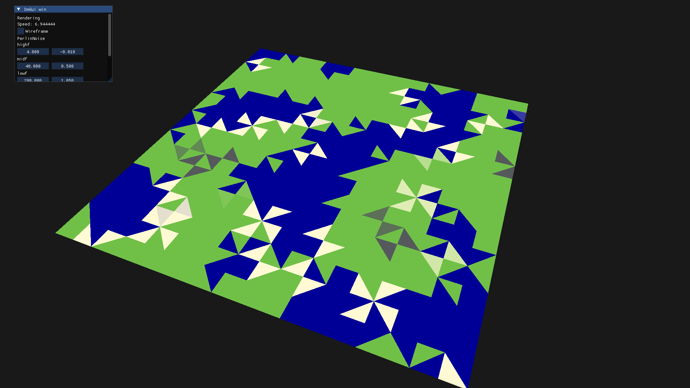
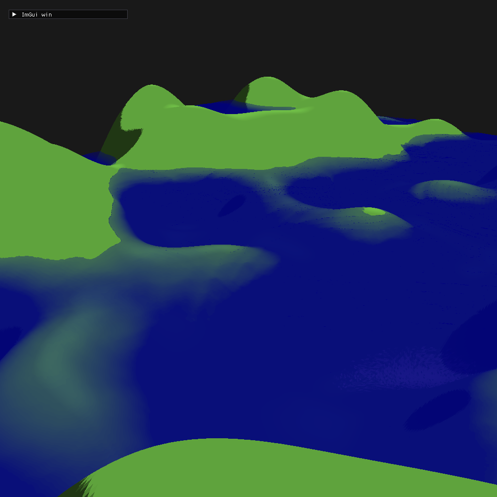
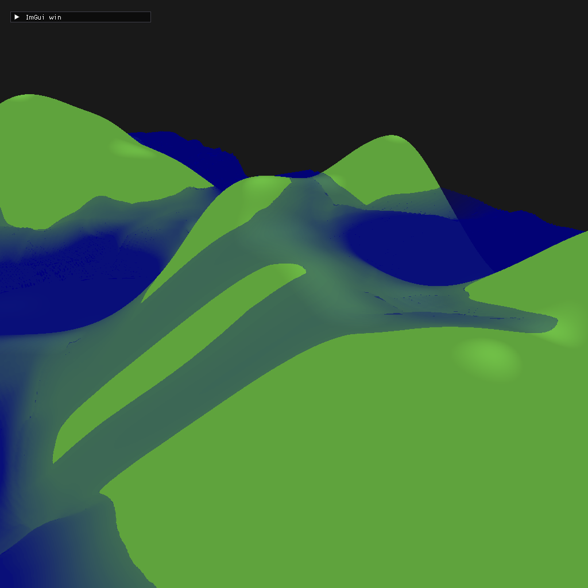

## Procedural terrain - C++/OpenGL

- perlin noise
- OOP texture, mesh classes
- camera movement
- imgui UI
- real time shadows, raytraced water reflections
- 2D water sim for hydraulic erosion

Playing around with noise maps.

##

##

