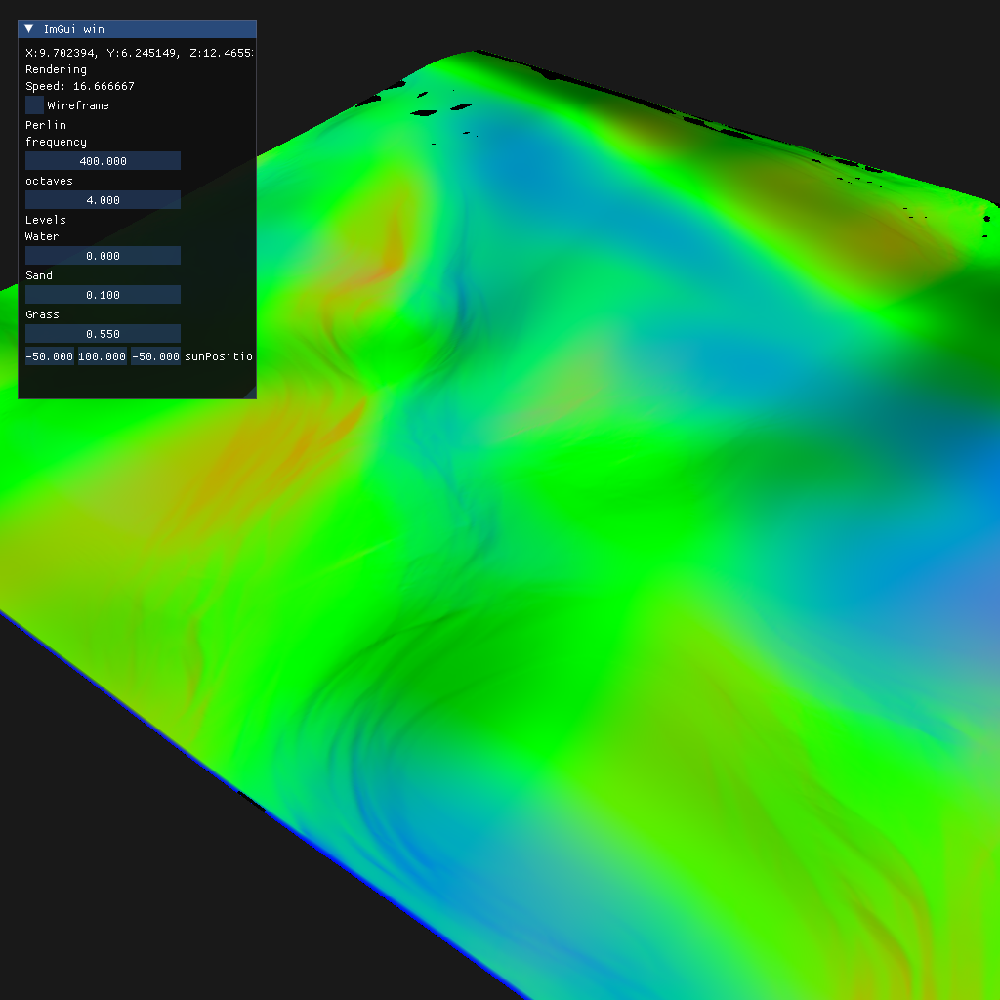

## Procedural terrain - C++/OpenGL

- perlin noise
- 2D water sim for hydraulic erosion
- OOP texture, mesh classes
- camera movement
- imgui UI
- real time shadows, raytraced water reflections

Playing around with noise maps. Really interested in trying to make terrain
playground similar to [From Dust](https://en.wikipedia.org/wiki/From_Dust).

### Simulated Erosion & Starting with Realistic Materials (PBR)

### Simulated Erosion (normal maps) - latest update

### Tesselation

### Water flow (beggining of erosion)

