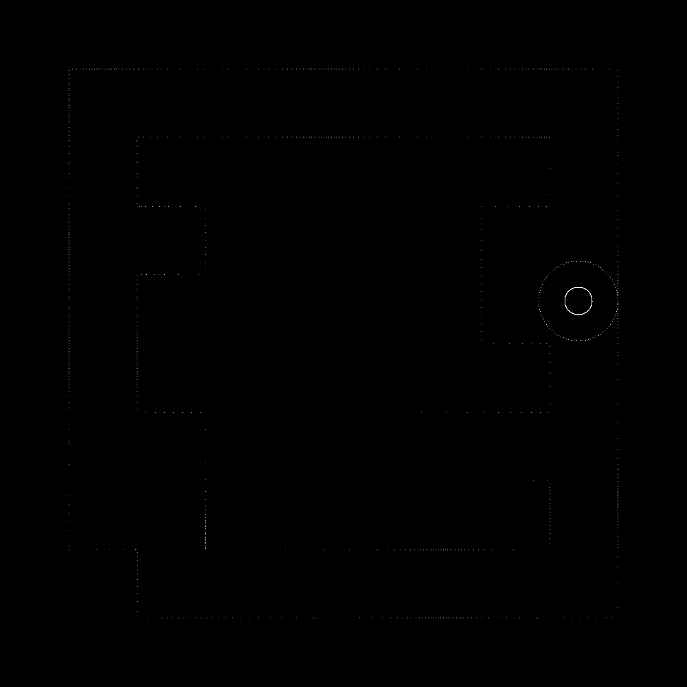
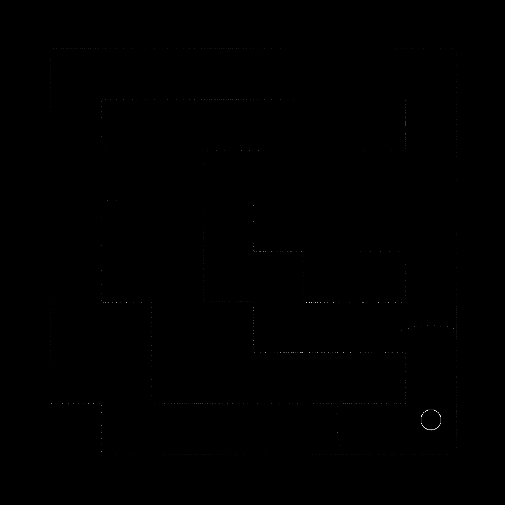

## Compute shader game

Inspired by some laser scanning game I once saw I made this compute shader
experiment. Used it to learn how to deal with multiple textures, working with
and writing compute shaders and the strength of them. You get to walk around in
2D environment and with *<space\>* the player creates small points like a sound
wave which reveal the environment around you.

